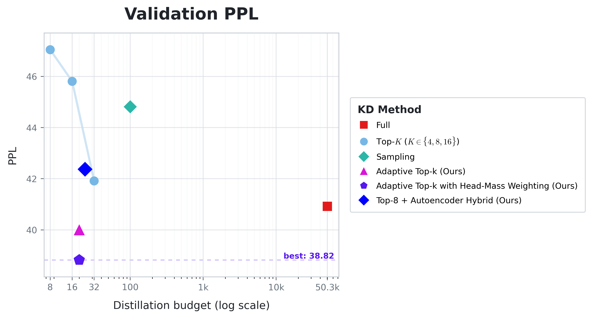
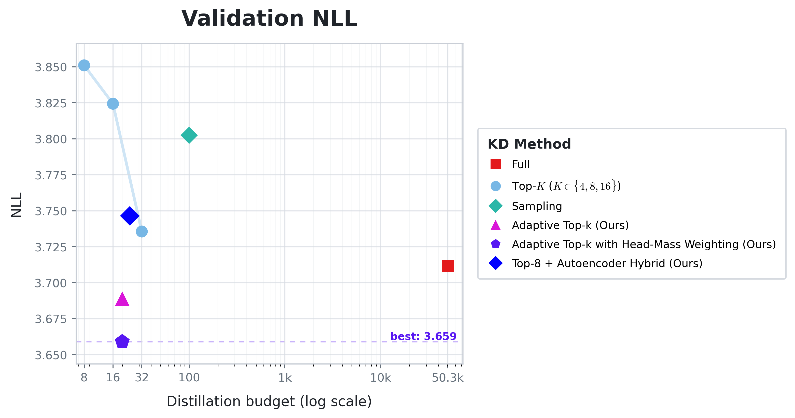
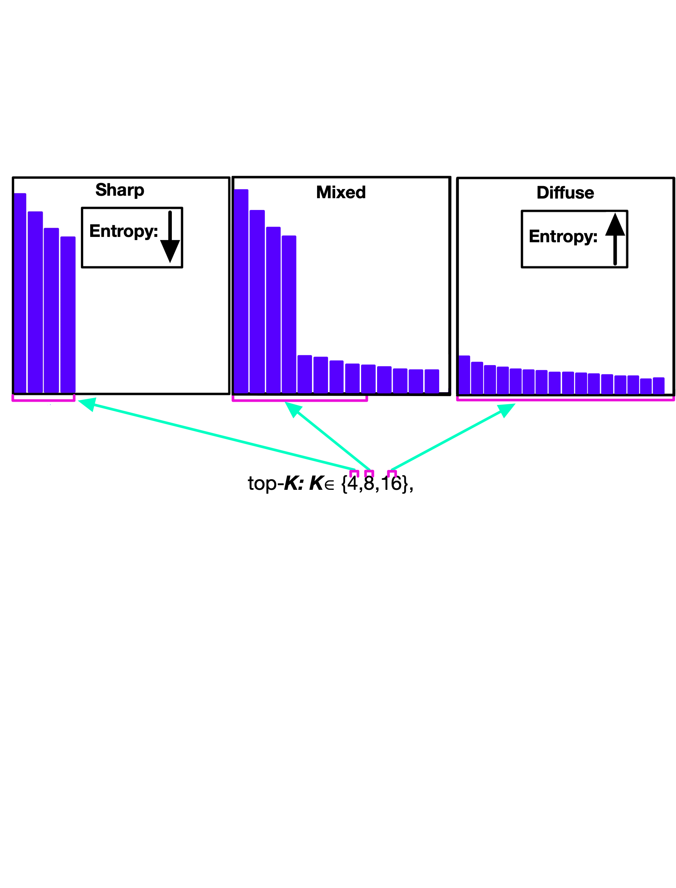
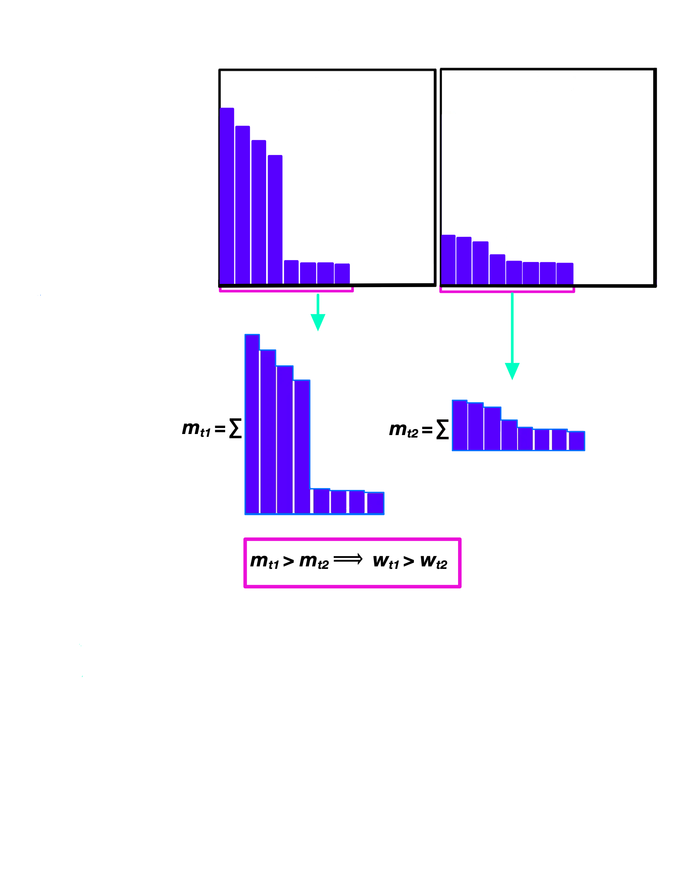

# Poster Plotting Code

## Overview

This folder contains the visuals from our poster, as well as the code we used to generate the validation PPL and NLL plots in our poster.

## Outputs

- `poster_plots/` contains the plots featured in our poster.
- `all_methods_plots/` contains the same plots with the Top-8 + Autoencoder Hybrid extension included.

## All-Methods Plots





## Full Project Poster
[Poster PDF](https://drive.google.com/file/d/18p-Zd08L1cyRhnDK7ykYS1KKHRs7v0JL/view?usp=sharing)


## Regenerating Plots

From the repository root:

```bash
python poster/plotter.py
```

## Diagrams

The illustrations of our adaptive sparse methods were manually drawn in Notability.

### Figure 1: Adaptive Top-K



### Figure 2: Adaptive Top-K + Head Mass Weighting


